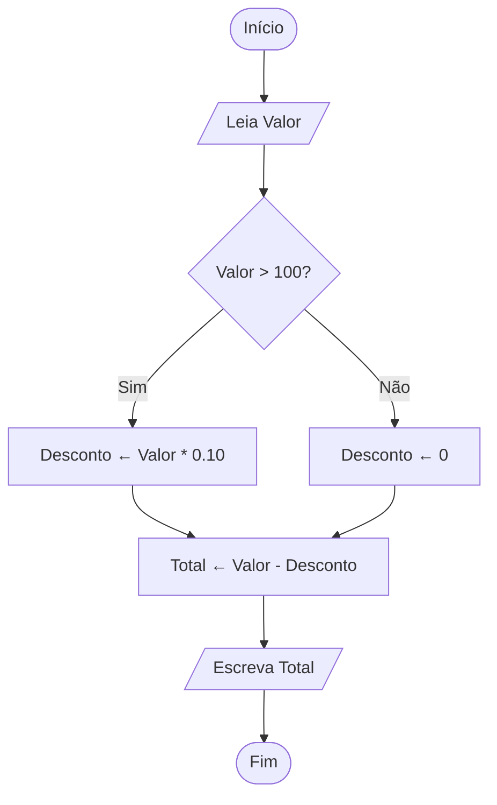

# Exercício 3 — Fluxograma: Desconto na loja

## Problema

Uma loja dá desconto de 10% para compras acima de R$ 100.
Leia o valor da compra e mostre o valor final a pagar.

---

## Legenda dos símbolos

| Símbolo       | Formato        | Significado                  |
|---------------|----------------|------------------------------|
| Oval          | `(( ))`        | Início / Fim                 |
| Paralelogramo | `[/ /]`        | Entrada / Saída              |
| Retângulo     | `[ ]`          | Processo / cálculo           |
| Losango       | `{ }`          | Decisão (Sim / Não)          |

---

## Fluxograma

---

